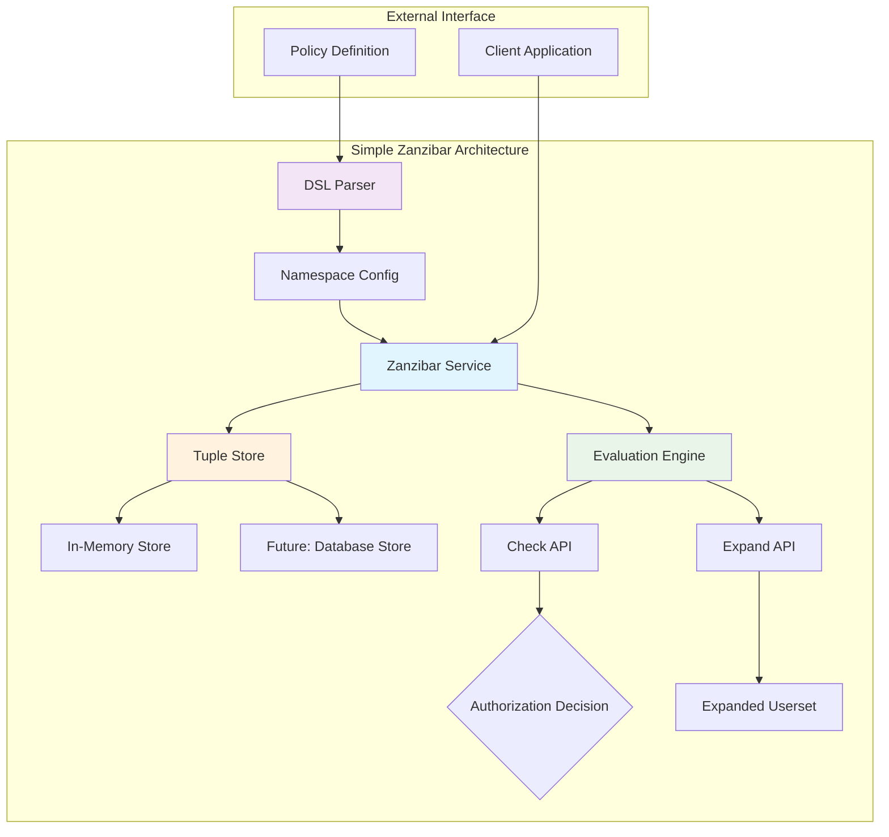
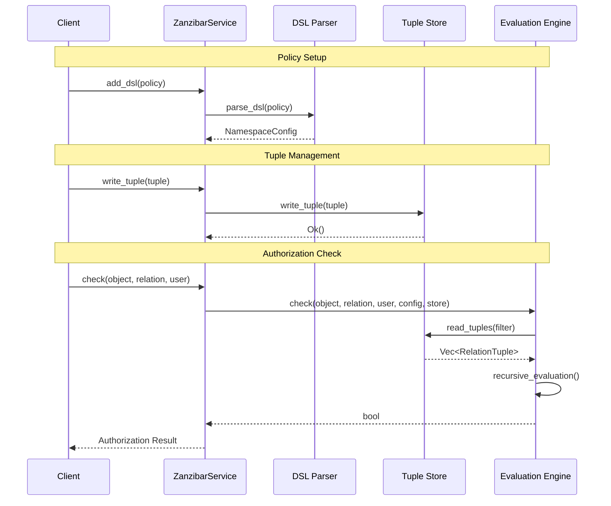
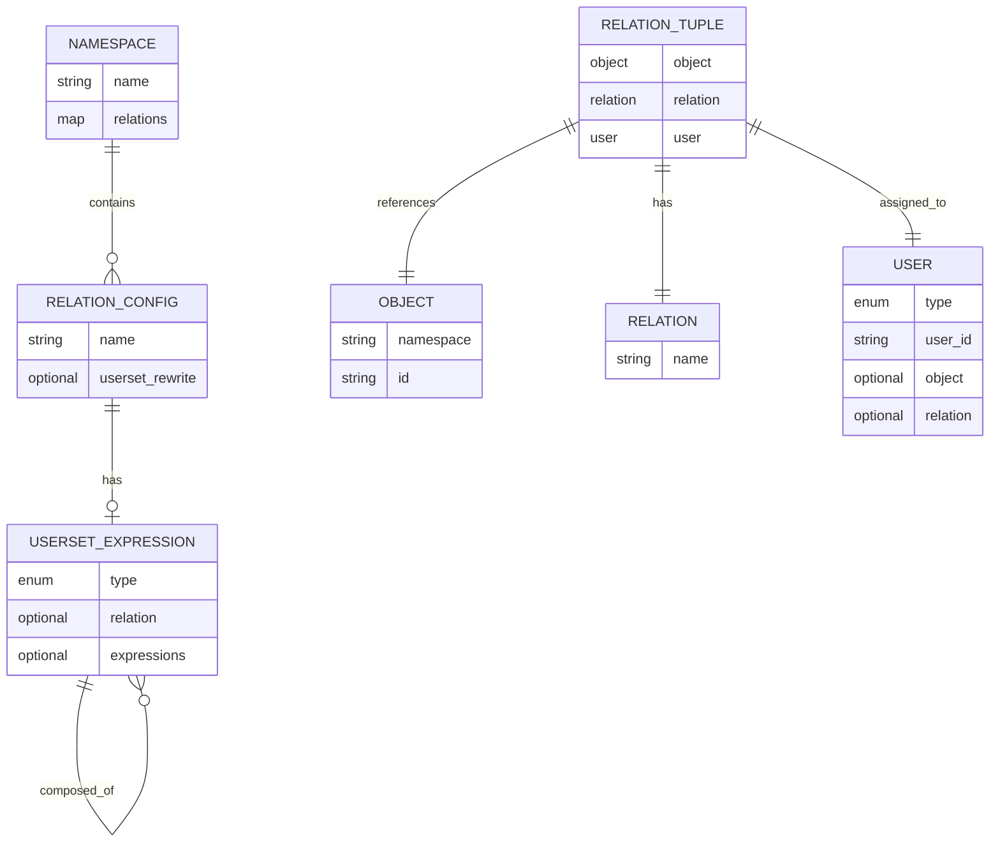

# Simple Zanzibar

[](https://crates.io/crates/simple-zanzibar)
[](https://docs.rs/simple-zanzibar)
[](https://opensource.org/licenses/MIT)
[](https://github.com/tyrchen/simple-zanzibar/actions)

A simplified Rust implementation of Google's Zanzibar authorization system, featuring a human-readable DSL for policy definition and comprehensive support for relationship-based access control (ReBAC).

## 🌟 What is Zanzibar?

[Google's Zanzibar](https://research.google/pubs/pub48190/) is a global authorization system that provides consistent, scalable authorization decisions across Google's services. It's based on the concept of **relationship tuples** that express relationships between objects and users.

### Key Concepts

- **Objects**: Resources in your system (e.g., `doc:readme`, `folder:photos`)
- **Relations**: Types of relationships (e.g., `owner`, `viewer`, `editor`)
- **Users**: Subjects that can have relationships (e.g., `user:alice`, `group:engineers`)
- **Tuples**: Assertions of relationships (e.g., `doc:readme#owner@user:alice`)

## 🏗️ Architecture



## 🔄 Data Flow



## 📊 Entity Relationship



## 🚀 Quick Start

Add this to your `Cargo.toml`:

```toml
[dependencies]
simple-zanzibar = "0.1.0"
```

### Basic Usage

```rust
use simple_zanzibar::{ZanzibarService, model::{Object, Relation, RelationTuple, User}};

fn main() -> Result<(), Box<dyn std::error::Error>> {
    let mut service = ZanzibarService::new();

    // Define policy using DSL
    let policy = r#"
        namespace doc {
            relation owner {}
            relation viewer {
                rewrite union(this, computed_userset(relation: "owner"))
            }
        }
    "#;

    service.add_dsl(policy)?;

    // Create objects and users
    let doc = Object { namespace: "doc".to_string(), id: "readme".to_string() };
    let alice = User::UserId("alice".to_string());

    // Grant permission
    service.write_tuple(RelationTuple {
        object: doc.clone(),
        relation: Relation("owner".to_string()),
        user: alice.clone(),
    })?;

    // Check permission
    let can_view = service.check(
        &doc,
        &Relation("viewer".to_string()),
        &alice
    )?;

    println!("Alice can view doc: {}", can_view); // true

    Ok(())
}
```

## 📝 DSL Reference

The Simple Zanzibar DSL allows you to define authorization policies in a human-readable format.

### Syntax Overview

```
namespace <namespace_name> {
    relation <relation_name> {
        rewrite <userset_expression>
    }
}
```

### Userset Expressions

#### 1. `this`

Direct relationship - users explicitly granted this relation.

```
relation owner {
    rewrite this
}
```

#### 2. `computed_userset(relation: "relation_name")`

Users who have another relation on the same object.

```
relation viewer {
    rewrite computed_userset(relation: "owner")
}
```

#### 3. `tuple_to_userset(tupleset: "relation1", computed_userset: "relation2")`

Users who have `relation2` on objects that have `relation1` with the current object.

```
relation viewer {
    rewrite tuple_to_userset(tupleset: "parent", computed_userset: "viewer")
}
```

#### 4. `union(expr1, expr2, ...)`

Users who satisfy any of the expressions.

```
relation viewer {
    rewrite union(
        this,
        computed_userset(relation: "owner"),
        computed_userset(relation: "editor")
    )
}
```

#### 5. `intersection(expr1, expr2, ...)`

Users who satisfy all expressions.

```
relation admin {
    rewrite intersection(
        computed_userset(relation: "owner"),
        computed_userset(relation: "manager")
    )
}
```

#### 6. `exclusion(base_expr, exclude_expr)`

Users in `base_expr` but not in `exclude_expr`.

```
relation editor {
    rewrite exclusion(
        computed_userset(relation: "viewer"),
        computed_userset(relation: "banned")
    )
}
```

### Complete Example

```
// File system with hierarchical permissions
namespace file {
    relation owner {}

    relation parent {}

    relation viewer {
        rewrite union(
            this,
            computed_userset(relation: "owner"),
            computed_userset(relation: "editor"),
            tuple_to_userset(tupleset: "parent", computed_userset: "viewer")
        )
    }

    relation editor {
        rewrite union(
            this,
            computed_userset(relation: "owner")
        )
    }
}

namespace folder {
    relation owner {}

    relation parent {}

    relation viewer {
        rewrite union(
            this,
            computed_userset(relation: "owner"),
            tuple_to_userset(tupleset: "parent", computed_userset: "viewer")
        )
    }
}
```

## 🔧 API Reference

### ZanzibarService

The main service for handling authorization.

```rust
impl ZanzibarService {
    // Create a new service
    pub fn new() -> Self

    // Load policy from DSL
    pub fn add_dsl(&mut self, dsl: &str) -> Result<(), ZanzibarError>

    // Add namespace configuration
    pub fn add_config(&mut self, config: NamespaceConfig)

    // Write a relation tuple
    pub fn write_tuple(&mut self, tuple: RelationTuple) -> Result<(), ZanzibarError>

    // Delete a relation tuple
    pub fn delete_tuple(&mut self, tuple: &RelationTuple) -> Result<(), ZanzibarError>

    // Check if user has relation to object
    pub fn check(&self, object: &Object, relation: &Relation, user: &User) -> Result<bool, ZanzibarError>

    // Expand userset for object and relation
    pub fn expand(&self, object: &Object, relation: &Relation) -> Result<ExpandedUserset, ZanzibarError>
}
```

### Data Types

```rust
// Object represents a resource
pub struct Object {
    pub namespace: String,
    pub id: String,
}

// Relation represents a permission type
pub struct Relation(pub String);

// User can be a direct user ID or a userset
pub enum User {
    UserId(String),
    Userset(Object, Relation),
}

// RelationTuple represents a permission assertion
pub struct RelationTuple {
    pub object: Object,
    pub relation: Relation,
    pub user: User,
}
```

## 📚 Examples

### File Permissions System

```bash
cargo run --example file_permissions
```

This example demonstrates:

- Hierarchical file and folder permissions
- Dynamic permission granting and revocation
- Permission inheritance through parent relationships
- Real-world usage patterns

### Custom Implementation

```rust
use simple_zanzibar::{ZanzibarService, model::*};

// Define your domain objects
let document = Object {
    namespace: "document".to_string(),
    id: "proposal.pdf".to_string()
};

let user = User::UserId("john.doe".to_string());

// Set up your service with policies
let mut service = ZanzibarService::new();
service.add_dsl(r#"
    namespace document {
        relation owner {}
        relation collaborator {}
        relation viewer {
            rewrite union(
                this,
                computed_userset(relation: "owner"),
                computed_userset(relation: "collaborator")
            )
        }
    }
"#)?;

// Grant permissions
service.write_tuple(RelationTuple {
    object: document.clone(),
    relation: Relation("collaborator".to_string()),
    user: user.clone(),
})?;

// Check permissions
let can_view = service.check(
    &document,
    &Relation("viewer".to_string()),
    &user
)?;
```

## 🧪 Testing

Run the test suite:

```bash
# Run all tests
cargo test

# Run specific test categories
cargo test --test integration_tests
cargo test --test storage_tests
cargo test --test eval_tests
cargo test --test parser_tests

# Run with output
cargo test -- --nocapture
```

## 🔍 Performance Considerations

- **In-Memory Storage**: Current implementation uses `HashSet` for fast lookups
- **Cycle Detection**: Prevents infinite recursion in policy evaluation
- **Extensible Storage**: `TupleStore` trait allows custom storage backends
- **Zero-Copy Parsing**: Efficient DSL parsing with `pest`

## 🛣️ Roadmap

- [ ] Persistent storage backends (PostgreSQL, Redis)
- [ ] Metrics and observability
- [ ] Policy validation and testing tools
- [ ] Performance benchmarks
- [ ] gRPC API server
- [ ] Policy migration tools

## 🤝 Contributing

Contributions are welcome! Please feel free to submit a Pull Request. For major changes, please open an issue first to discuss what you would like to change.

1. Fork the repository
2. Create your feature branch (`git checkout -b feature/amazing-feature`)
3. Commit your changes (`git commit -m 'Add some amazing feature'`)
4. Push to the branch (`git push origin feature/amazing-feature`)
5. Open a Pull Request

## 📄 License

This project is licensed under the MIT License - see the [LICENSE](LICENSE.md) file for details.

## 🙏 Acknowledgments

- [Google's Zanzibar paper](https://research.google/pubs/pub48190/) for the foundational concepts
- [OpenFGA](https://openfga.dev/) for inspiration on DSL design
- The Rust community for excellent crates like `pest` and `thiserror`

## 📞 Support

- 📖 [Documentation](https://docs.rs/simple-zanzibar)
- 🐛 [Issue Tracker](https://github.com/tyrchen/simple-zanzibar/issues)
- 💬 [Discussions](https://github.com/tyrchen/simple-zanzibar/discussions)

---

**Simple Zanzibar** - Making authorization simple, scalable, and secure. 🔐
