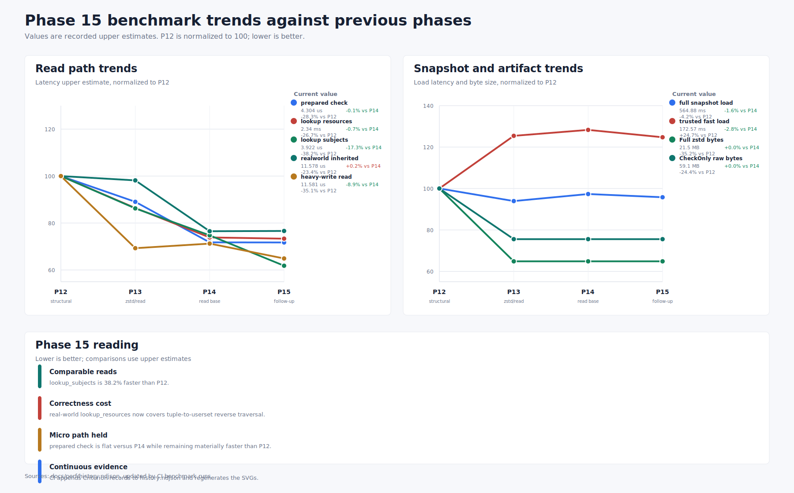

# Phase 15 Complete Benchmark Report - 2026-05-25

Measured on the Phase 15 PR after the adaptive planner, nested-memo, schema-aware tuple producer,
and lookup-frontier correctness follow-up.

Commands:

- `make bench-all`
- `cargo bench --bench concurrent_runtime`
- `cargo bench --features bench-internals --bench read_followup_allocations`
- `cargo bench --features bench-internals --bench perf_optimization -- check_prepared_1m --sample-size 10`
- `cargo bench --features bench-internals --bench perf_optimization -- lookup_resources_streaming_1m --sample-size 20`
- `cargo bench --features bench-internals --bench perf_optimization -- lookup_subjects_streaming_1m --sample-size 20`
- `cargo bench --features bench-internals --bench perf_optimization -- read_heavy --sample-size 10`
- `cargo bench --features bench-internals --bench perf_optimization -- phase15 --sample-size 10`
- `cargo bench --bench realworld_authorization -- 1m_rules --sample-size 10`

Criterion timings are reported as `low / estimate / high`.

## Summary

- Phase comparisons use recorded upper estimates from earlier phase evidence, not Criterion's local
  previous-run cache. Lower is better for every comparison below.
- Core read microbenchmarks are back inside gate: prepared check is `-0.1%`, streaming
  lookup-resources is `-0.7%`, streaming lookup-subjects is `-17.3%`, and heavy-write read latency
  is `-8.9%` versus Phase 14.
- `lookup_subjects_streaming_1m` is the clean Phase 15 win: `-17.3%` versus Phase 14 and `-38.2%`
  versus Phase 12.
- The `lookup_resources` follow-up now preserves tuple-to-userset reverse lookup when the tuple row
  subject relation differs from the computed relation. This changes the real-world lookup workload
  from the earlier under-enumerating Phase 14/early-Phase-15 behavior, so the real-world
  `lookup_resources_target_user` and `mixed_read_workload` rows are correctness-sensitive rather
  than apples-to-apples latency regressions.
- Non-read path regressions to watch separately: small schema apply, policy file export, and public
  snapshot save at 100k.

## Phase 15.5 / 15.7 Follow-Up Run

Follow-up evidence was appended to [history.ndjson](history.ndjson) as the `local` run and the SVGs
were regenerated by `make perf-charts`.

Core gate comparison, upper estimates:

| Benchmark | Scenario | Phase 14 upper | Follow-up upper | Delta |
| --- | --- | ---: | ---: | ---: |
| `perf_optimization/check_prepared_1m` | Prepared check micro hot path | `4.3065 us` | `4.2865 us` | `-0.5%` |
| `perf_optimization/lookup_resources_streaming_1m` | Streaming resource lookup micro fixture | `2.3551 ms` | `2.3705 ms` | `+0.7%` |
| `perf_optimization/lookup_subjects_streaming_1m` | Streaming subject lookup micro fixture | `4.7426 us` | `4.0322 us` | `-15.0%` |
| `perf_optimization/read_heavy_heavy_write_batched_1m` | Heavy batched write/read mix | `12.712 us` | `13.046 us` | `+2.6%` |
| `realworld_authorization/1m_rules/check_doc_inherited_workspace_member` | Realistic inherited permission check | `11.559 us` | `11.745 us` | `+1.6%` |
| `snapshot_load_compact/1m` | Full compact snapshot load | `573.95 ms` | `583.09 ms` | `+1.6%` |
| `snapshot_load_trusted_fast/1m` | Trusted-fast snapshot load | `177.49 ms` | `179.62 ms` | `+1.2%` |

Correctness-sensitive lookup-resource rows remain non-comparable to Phase 14 because Phase 15 now
returns nested tuple-to-userset resources that the earlier path skipped:

| Benchmark | Follow-up upper | Reading |
| --- | ---: | --- |
| `realworld_authorization/1m_rules/lookup_resources_target_user` | `650.61 us` | Correct reverse tuple traversal remains the dominant cost. |
| `realworld_authorization/1m_rules/mixed_read_workload` | `677.94 us` | Improved from the previous Phase 15 full run but still dominated by corrected lookup-resources. |

Targeted Phase 15 fixtures:

| Benchmark | Follow-up upper | Counters / interpretation |
| --- | ---: | --- |
| `perf_optimization/phase15_memo_shared_parent` | `2.1891 ms` | `999` memo hits and `1003` misses/inserts; no depth skips. |
| `perf_optimization/phase15_lookup_subjects_allocation` | `808.09 us` | `1000` subject candidates, `1000` userset candidates, `0` full-root checks. |
| `perf_optimization/phase15_high_fanout_posting` | `135.00 us` | High-fanout subject enumeration stays on the positive-proof shortcut. |
| `perf_optimization/phase15_lookup_planner_pruning` | `1.5216 ms` | `50000` schema-pruned relationships and `0` full-root checks; still ~65x faster than the original `99.013 ms` baseline. |

Allocation companion over 16 iterations:

| Benchmark | Allocations | Bytes |
| --- | ---: | ---: |
| `read_followup_allocations/phase15_memo_shared_parent` | `673,905` | `25,603,136` |
| `read_followup_allocations/phase15_lookup_subjects_allocation` | `272,672` | `13,003,712` |
| `read_followup_allocations/phase15_high_fanout_posting` | `32,400` | `6,350,288` |

## Phase Trend Comparison

Additional generated views:

- [Phase 15 performance delta bars](phase-15-performance-deltas.svg)
- [Continuous performance dashboard](continuous-performance-dashboard.svg)
- [Canonical NDJSON history](history.ndjson)

`P12` is the structural read baseline, `P13` is the zstd/read first-pass evidence, `P14` is the
Phase 14 completion/follow-up baseline from `specs/71-performance-budgets-design.md`, and `P15` is
the current full benchmark run after Phase 15.1, 15.2, 15.5, and the tuple-to-userset
lookup-resources correctness follow-up. Values are upper estimates.

| Benchmark | Scenario | P12 | P13 | P14 baseline | P15 current | P15 vs P14 | P15 vs P12 |
| --- | --- | ---: | ---: | ---: | ---: | ---: | ---: |
| `perf_optimization/check_prepared_1m` | Prepared check micro hot path | `6.0009 us` | `5.3424 us` | `4.3065 us` | `4.3037 us` | `-0.1%` | `-28.3%` |
| `perf_optimization/lookup_resources_streaming_1m` | Streaming resource lookup micro fixture | `3.1883 ms` | `2.7544 ms` | `2.3551 ms` | `2.3383 ms` | `-0.7%` | `-26.7%` |
| `perf_optimization/lookup_subjects_streaming_1m` | Streaming subject lookup micro fixture | `6.3451 us` | `5.4722 us` | `4.7426 us` | `3.9218 us` | `-17.3%` | `-38.2%` |
| `realworld_authorization/1m_rules/check_doc_inherited_workspace_member` | Realistic inherited permission check | `15.110 us` | `14.833 us` | `11.559 us` | `11.578 us` | `+0.2%` | `-23.4%` |
| `perf_optimization/read_heavy_heavy_write_batched_1m` | Read latency while heavy batched writes publish | `17.844 us` | `12.365 us` | `12.712 us` | `11.581 us` | `-8.9%` | `-35.1%` |
| `snapshot_load_compact/1m` | Full compact snapshot load | `589.75 ms` | `553.98 ms` | `573.95 ms` | `564.88 ms` | `-1.6%` | `-4.2%` |
| `snapshot_load_trusted_fast/1m` | Trusted-fast snapshot load | `138.34 ms` | `173.52 ms` | `177.49 ms` | `172.57 ms` | `-2.8%` | `+24.7%` |
| `snapshot_section_size/full_1m/total_bytes` zstd | Full-profile compressed artifact size | `33.1 MB` | `21.5 MB` | `21.5 MB` | `21.5 MB` | `0.0%` | `-35.2%` |
| `snapshot_section_size/check_only_1m/total_bytes` raw | CheckOnly raw artifact size | `78.2 MB` | `59.1 MB` | `59.1 MB` | `59.1 MB` | `0.0%` | `-24.4%` |

Correctness-sensitive real-world rows:

| Benchmark | Scenario | P14 baseline | P15 current | Reading |
| --- | --- | ---: | ---: | --- |
| `realworld_authorization/1m_rules/lookup_resources_target_user` | Resource lookup through nested tuple-to-userset inheritance | `5.6645 us` | `643.62 us` | Now performs the reverse tuple traversal that earlier phases skipped. |
| `realworld_authorization/1m_rules/mixed_read_workload` | Mixed check/lookup/expand read workload | `41.808 us` | `758.78 us` | Dominated by the corrected lookup-resources leg. |

## Baseline Synthetic

| Benchmark | Scenario | Result |
| --- | --- | ---: |
| `indexed_direct_check_100k` | Direct relation check on indexed store | `534.19 ns / 539.99 ns / 545.18 ns` |
| `one_hop_userset_check_100k` | One nested userset membership check | `1.1604 us / 1.1701 us / 1.1770 us` |
| `tuple_to_userset_check_100k` | Tuple-to-userset inherited permission check | `1.0363 us / 1.0414 us / 1.0461 us` |
| `lookup_resources_100_candidates` | Reverse lookup across 100 direct candidates | `106.63 us / 107.28 us / 108.19 us` |
| `lookup_resources_1000_candidates` | Reverse lookup across 1k direct candidates | `1.6296 ms / 1.7161 ms / 1.8372 ms` |
| `lookup_resources_10000_candidates` | Reverse lookup across 10k direct candidates | `12.376 ms / 12.949 ms / 13.494 ms` |
| `legacy_store_read_tuples_scan_100k` | Legacy tuple-store full scan read | `582.57 us / 591.58 us / 600.63 us` |

## Building Blocks

| Benchmark | Scenario | Result |
| --- | --- | ---: |
| `building_blocks/relationship_parse` | Parse one relationship string | `144.43 ns / 145.79 ns / 147.33 ns` |
| `building_blocks/schema_apply` | Parse and compile a small schema | `64.264 us / 65.040 us / 65.668 us` |
| `building_blocks/write_batch_10k` | Write 10k relationship mutations | `11.372 ms / 11.469 ms / 11.576 ms` |
| `building_blocks/indexed_store_exact_query_100k` | Exact resource/relation/subject store query | `174.78 ns / 176.37 ns / 178.23 ns` |
| `building_blocks/indexed_store_reverse_query_100k` | Subject-side reverse index query | `33.663 us / 33.828 us / 34.035 us` |

## Org Authorization

| Benchmark | Scenario | Result |
| --- | --- | ---: |
| `org_authorization/1k_rules/check_direct_group_viewer` | Direct group viewer check, 1k tuples | `1.8924 us / 1.9023 us / 1.9117 us` |
| `org_authorization/1k_rules/check_inherited_folder_viewer` | Folder inheritance check, 1k tuples | `4.2715 us / 4.2968 us / 4.3246 us` |
| `org_authorization/1k_rules/check_denied_exclusion` | Deny-list exclusion check, 1k tuples | `711.70 ns / 715.92 ns / 720.47 ns` |
| `org_authorization/1k_rules/check_editor_can_edit` | Editor permission check, 1k tuples | `1.3381 us / 1.3443 us / 1.3519 us` |
| `org_authorization/1k_rules/expand_direct_doc_viewers` | Expand direct document viewers, 1k tuples | `1.8219 us / 1.8371 us / 1.8547 us` |
| `org_authorization/1k_rules/lookup_resources_target_user` | Find resources visible to target user, 1k tuples | `481.99 us / 489.13 us / 497.98 us` |
| `org_authorization/1k_rules/lookup_subjects_direct_doc` | Enumerate subjects for one document, 1k tuples | `3.9202 us / 3.9448 us / 3.9714 us` |
| `org_authorization/100k_rules/check_direct_group_viewer` | Direct group viewer check, 100k tuples | `1.9282 us / 1.9637 us / 2.0307 us` |
| `org_authorization/100k_rules/check_inherited_folder_viewer` | Folder inheritance check, 100k tuples | `4.3215 us / 4.3592 us / 4.4167 us` |
| `org_authorization/100k_rules/check_denied_exclusion` | Deny-list exclusion check, 100k tuples | `709.43 ns / 716.52 ns / 726.79 ns` |
| `org_authorization/100k_rules/check_editor_can_edit` | Editor permission check, 100k tuples | `1.3416 us / 1.3518 us / 1.3604 us` |
| `org_authorization/100k_rules/expand_direct_doc_viewers` | Expand direct document viewers, 100k tuples | `1.8570 us / 1.8770 us / 1.8938 us` |
| `org_authorization/100k_rules/lookup_resources_target_user` | Find resources visible to target user, 100k tuples | `2.6306 ms / 2.6721 ms / 2.7259 ms` |
| `org_authorization/100k_rules/lookup_subjects_direct_doc` | Enumerate subjects for one document, 100k tuples | `3.9729 us / 3.9935 us / 4.0142 us` |
| `org_authorization/1m_rules/check_direct_group_viewer` | Direct group viewer check, 1m tuples | `1.9403 us / 1.9464 us / 1.9537 us` |
| `org_authorization/1m_rules/check_inherited_folder_viewer` | Folder inheritance check, 1m tuples | `4.2932 us / 4.3299 us / 4.3720 us` |
| `org_authorization/1m_rules/check_denied_exclusion` | Deny-list exclusion check, 1m tuples | `708.16 ns / 715.33 ns / 719.62 ns` |
| `org_authorization/1m_rules/check_editor_can_edit` | Editor permission check, 1m tuples | `1.3614 us / 1.3703 us / 1.3782 us` |
| `org_authorization/1m_rules/expand_direct_doc_viewers` | Expand direct document viewers, 1m tuples | `1.8318 us / 1.8472 us / 1.8707 us` |
| `org_authorization/1m_rules/lookup_resources_target_user` | Find resources visible to target user, 1m tuples | `2.6236 ms / 2.6585 ms / 2.6894 ms` |
| `org_authorization/1m_rules/lookup_subjects_direct_doc` | Enumerate subjects for one document, 1m tuples | `3.9794 us / 3.9988 us / 4.0374 us` |

## Snapshot

| Benchmark | Scenario | Result |
| --- | --- | ---: |
| `snapshot_build_from_relationships/1k` | Build compact snapshot from 1k relationships | `967.23 us / 974.07 us / 984.71 us` |
| `snapshot_build_from_relationships/100k` | Build compact snapshot from 100k relationships | `194.75 ms / 196.13 ms / 197.51 ms` |
| `snapshot_build_from_relationships/1m` | Build compact snapshot from 1m relationships | `6.0816 s / 6.1091 s / 6.1403 s` |
| `snapshot_save_uncompressed/1m` | Save 1m snapshot without compression | `1.4166 s / 1.4233 s / 1.4304 s` |
| `snapshot_save_zstd/1m` | Save 1m snapshot with zstd | `1.5144 s / 1.5212 s / 1.5283 s` |
| `snapshot_load_compact/1k` | Load 1k compact snapshot | `880.24 us / 953.57 us / 1.0333 ms` |
| `snapshot_load_compact/100k` | Load 100k compact snapshot | `52.804 ms / 53.483 ms / 54.201 ms` |
| `snapshot_load_compact/1m` | Load 1m compact snapshot | `559.92 ms / 562.27 ms / 564.88 ms` |
| `snapshot_load_trusted_fast/1m` | Trusted-fast load of 1m snapshot | `170.03 ms / 171.22 ms / 172.57 ms` |
| `snapshot_load_and_reindex/1m` | Load 1m snapshot and rebuild indexes | `769.20 ms / 772.69 ms / 775.35 ms` |
| `snapshot_load_zstd/1m` | Load zstd-compressed 1m snapshot | `625.04 ms / 626.96 ms / 629.41 ms` |
| `snapshot_load_peak_rss/1m` | Load 1m snapshot for RSS timing proxy | `560.83 ms / 563.19 ms / 565.62 ms` |
| `snapshot_loaded_check_direct/1m` | Direct check after normal snapshot load | `2.1374 us / 2.1501 us / 2.1642 us` |
| `snapshot_loaded_check_inherited/1m` | Inherited check after normal snapshot load | `4.8209 us / 4.8379 us / 4.8577 us` |
| `snapshot_loaded_lookup_resources/1m` | Lookup resources after normal snapshot load | `2.9715 ms / 3.0770 ms / 3.1936 ms` |
| `snapshot_trusted_loaded_check_direct/1m` | Direct check after trusted-fast load | `2.1324 us / 2.1465 us / 2.1667 us` |
| `snapshot_trusted_loaded_check_inherited/1m` | Inherited check after trusted-fast load | `4.8819 us / 4.9019 us / 4.9215 us` |
| `snapshot_trusted_loaded_lookup_resources/1m` | Lookup resources after trusted-fast load | `3.4464 ms / 3.4960 ms / 3.5555 ms` |
| `snapshot_file_size/1m` | Uncompressed 1m snapshot size probe: `77,573,646` bytes | `457.51 ps / 460.85 ps / 463.90 ps` |
| `snapshot_file_size_zstd/1m` | Zstd 1m snapshot size probe: `21,512,241` bytes | `459.92 ps / 461.82 ps / 464.54 ps` |

## Public API

| Benchmark | Scenario | Result |
| --- | --- | ---: |
| `public_api/apply_schema/small` | Public schema apply | `72.559 us / 72.850 us / 73.026 us` |
| `public_api/replace_schema/small` | Public schema replacement | `80.992 us / 85.157 us / 88.230 us` |
| `public_api/delete_relation/small` | Delete one relation from schema | `44.593 us / 46.916 us / 49.541 us` |
| `public_api/delete_namespace/small` | Delete one namespace from schema | `46.759 us / 48.320 us / 51.155 us` |
| `public_api/check/100k` | Public permission check on 100k fixture | `1.9198 us / 1.9296 us / 1.9433 us` |
| `public_api/expand/100k` | Public expand on 100k fixture | `3.3630 us / 3.3911 us / 3.4418 us` |
| `public_api/lookup_resources/100k` | Public lookup resources on 100k fixture | `2.5736 ms / 2.6019 ms / 2.6308 ms` |
| `public_api/lookup_subjects/100k` | Public lookup subjects on 100k fixture | `4.0320 us / 4.0687 us / 4.1063 us` |
| `public_api/lookup_permissions/100k` | Public lookup permissions on one resource | `8.0438 us / 8.0898 us / 8.1656 us` |
| `public_api/lookup_object_permissions/100k` | Public object-permission audit helper | `8.4827 us / 8.5846 us / 8.6792 us` |
| `public_api/write_relationships/1k_batch` | Public 1k relationship write batch | `4.7369 ms / 5.3663 ms / 6.0198 ms` |
| `public_api/apply_policy_text/1k` | Apply policy text with 1k relationships | `1.2120 ms / 1.2827 ms / 1.4384 ms` |
| `public_api/export_policy_text/100k` | Export policy text from 100k fixture | `39.542 ms / 39.956 ms / 40.447 ms` |
| `public_api/export_policy_files/1k` | Export policy files from 1k fixture | `1.1130 ms / 1.2062 ms / 1.2939 ms` |
| `public_api/snapshot_save_uncompressed/100k` | Public uncompressed snapshot save | `121.63 ms / 123.06 ms / 124.62 ms` |
| `public_api/snapshot_load_uncompressed/100k` | Public uncompressed snapshot load | `52.351 ms / 53.069 ms / 54.026 ms` |
| `public_api/snapshot_save_zstd/100k` | Public zstd snapshot save | `136.36 ms / 137.78 ms / 139.18 ms` |
| `public_api/snapshot_load_zstd/100k` | Public zstd snapshot load | `57.549 ms / 58.274 ms / 59.137 ms` |

## Concurrent Runtime

| Benchmark | Scenario | Criterion result |
| --- | --- | ---: |
| `concurrent_runtime/read_heavy_light_write_batched` | 8 readers, 1 batched writer with pauses | `541.83 ms / 547.07 ms / 553.63 ms` |
| `concurrent_runtime/read_heavy_medium_write_unbatched` | 8 readers, 1 unbatched writer | `534.44 ms / 535.71 ms / 536.87 ms` |
| `concurrent_runtime/read_heavy_medium_write_batched` | 8 readers, 1 heavy batched writer | `549.55 ms / 552.15 ms / 554.90 ms` |
| `concurrent_runtime/read_heavy_heavy_write_unbatched` | 8 readers, 4 unbatched writers | `532.15 ms / 533.50 ms / 534.79 ms` |
| `concurrent_runtime/read_heavy_heavy_write_batched` | 8 readers, 4 batched writers | `554.00 ms / 557.23 ms / 560.64 ms` |
| `concurrent_runtime/tenant_sharded_heavy_write_batched` | 8 readers, 4 batched writers, 4 tenants | `625.04 ms / 650.90 ms / 689.53 ms` |

Throughput summary from the same run:

| Scenario | Read ops/s | Write calls/s | Logical writes/s | Write p50/p95/max us |
| --- | ---: | ---: | ---: | ---: |
| light batched write | `5,920,946` | `34` | `1,088` | `437 / 548 / 594` |
| medium unbatched write | `5,911,324` | `1,996` | `1,996` | `428 / 1049 / 2751` |
| medium batched write | `6,142,022` | `776` | `99,328` | `1076 / 2807 / 5086` |
| heavy unbatched write | `6,069,852` | `2,878` | `2,878` | `1522 / 2754 / 5114` |
| heavy batched write | `6,277,496` | `878` | `112,384` | `4004 / 9153 / 11979` |
| tenant-sharded heavy batched write | `9,202,472` | `3,676` | `470,528` | `719 / 2754 / 11522` |

## Real-World Authorization

| Benchmark | Scenario | Result |
| --- | --- | ---: |
| `realworld_authorization/100k_rules/check_doc_inherited_workspace_member` | Workspace membership inheritance, 100k | `10.131 us / 10.210 us / 10.305 us` |
| `realworld_authorization/100k_rules/check_doc_direct_user` | Direct document grant, 100k | `2.3679 us / 2.3926 us / 2.4394 us` |
| `realworld_authorization/100k_rules/check_doc_denied_by_ban` | Deny-by-ban check, 100k | `741.25 ns / 746.54 ns / 753.38 ns` |
| `realworld_authorization/100k_rules/check_doc_project_editor` | Project editor permission, 100k | `3.9327 us / 3.9644 us / 3.9960 us` |
| `realworld_authorization/100k_rules/lookup_resources_target_user` | User resource lookup, 100k | `5.3523 us / 5.3851 us / 5.4213 us` |
| `realworld_authorization/100k_rules/lookup_subjects_shared_doc` | Shared document subject lookup, 100k | `7.0190 us / 7.0601 us / 7.1137 us` |
| `realworld_authorization/100k_rules/lookup_permissions_shared_doc` | Permission enumeration, 100k | `6.7696 us / 6.8437 us / 6.9533 us` |
| `realworld_authorization/100k_rules/lookup_object_permissions_shared_doc` | Object-permission subject audit, 100k | `15.015 us / 15.074 us / 15.108 us` |
| `realworld_authorization/100k_rules/expand_shared_doc` | Expand shared document userset, 100k | `2.0063 us / 2.0204 us / 2.0425 us` |
| `realworld_authorization/100k_rules/mixed_read_workload` | Mixed check/lookup/expand workload, 100k | `38.971 us / 39.236 us / 39.701 us` |
| `realworld_authorization/100k_rules/snapshot_load_compact` | Real-world compact snapshot load, 100k | `50.817 ms / 51.362 ms / 52.072 ms` |
| `realworld_authorization/100k_rules/snapshot_load_trusted_fast` | Real-world trusted-fast load, 100k | `17.947 ms / 18.077 ms / 18.241 ms` |
| `realworld_authorization/100k_rules/snapshot_file_size` | Real-world snapshot size: `8,181,511` bytes | `459.61 ps / 461.75 ps / 465.17 ps` |
| `realworld_authorization/1m_rules/check_doc_inherited_workspace_member` | Workspace membership inheritance, 1m | `11.543 us / 11.644 us / 11.754 us` |
| `realworld_authorization/1m_rules/check_doc_direct_user` | Direct document grant, 1m | `2.4403 us / 2.4680 us / 2.4894 us` |
| `realworld_authorization/1m_rules/check_doc_denied_by_ban` | Deny-by-ban check, 1m | `759.82 ns / 766.60 ns / 772.58 ns` |
| `realworld_authorization/1m_rules/check_doc_project_editor` | Project editor permission, 1m | `3.9912 us / 4.0215 us / 4.0500 us` |
| `realworld_authorization/1m_rules/lookup_resources_target_user` | User resource lookup, 1m | `619.42 us / 631.46 us / 643.62 us` |
| `realworld_authorization/1m_rules/lookup_subjects_shared_doc` | Shared document subject lookup, 1m | `7.0134 us / 7.0501 us / 7.0739 us` |
| `realworld_authorization/1m_rules/lookup_permissions_shared_doc` | Permission enumeration, 1m | `6.7388 us / 6.7712 us / 6.8075 us` |
| `realworld_authorization/1m_rules/lookup_object_permissions_shared_doc` | Object-permission subject audit, 1m | `15.252 us / 15.344 us / 15.416 us` |
| `realworld_authorization/1m_rules/expand_shared_doc` | Expand shared document userset, 1m | `2.0508 us / 2.0599 us / 2.0731 us` |
| `realworld_authorization/1m_rules/mixed_read_workload` | Mixed check/lookup/expand workload, 1m | `727.72 us / 740.05 us / 758.78 us` |
| `realworld_authorization/1m_rules/snapshot_load_compact` | Real-world compact snapshot load, 1m | `571.08 ms / 573.68 ms / 577.39 ms` |
| `realworld_authorization/1m_rules/snapshot_load_trusted_fast` | Real-world trusted-fast load, 1m | `177.36 ms / 178.39 ms / 179.49 ms` |
| `realworld_authorization/1m_rules/snapshot_file_size` | Real-world snapshot size: `79,624,979` bytes | `461.16 ps / 464.25 ps / 468.13 ps` |

## Perf Optimization

| Benchmark | Scenario | Result |
| --- | --- | ---: |
| `perf_optimization/check_prepared_1m` | Prepared check hot path | `4.2282 us / 4.2664 us / 4.3037 us` |
| `perf_optimization/lookup_resources_streaming_1m` | Lookup resources streaming fixture | `2.2699 ms / 2.3034 ms / 2.3383 ms` |
| `perf_optimization/lookup_subjects_streaming_1m` | Lookup subjects streaming fixture | `3.8570 us / 3.8878 us / 3.9218 us` |
| `perf_optimization/write_single_touch_1m` | Single touch write on 1m base | `106.76 us / 148.67 us / 174.73 us` |
| `perf_optimization/write_mixed_batch_1m` | Mixed write batch on 1m base | `798.23 us / 2.5633 ms / 5.7451 ms` |
| `perf_optimization/read_heavy_light_write_1m` | Read-heavy workload with light writes | `11.208 us / 11.882 us / 12.358 us` |
| `perf_optimization/read_heavy_medium_write_unbatched_1m` | Read-heavy workload with medium unbatched writes | `11.043 us / 11.743 us / 12.712 us` |
| `perf_optimization/read_heavy_medium_write_batched_1m` | Read-heavy workload with medium batched writes | `10.890 us / 12.130 us / 13.262 us` |
| `perf_optimization/read_heavy_heavy_write_unbatched_1m` | Read-heavy workload with heavy unbatched writes | `11.446 us / 12.117 us / 12.813 us` |
| `perf_optimization/read_heavy_heavy_write_batched_1m` | Read-heavy workload with heavy batched writes | `9.5717 us / 10.704 us / 11.581 us` |
| `perf_optimization/read_heavy_delta_counters_1m` | Delta/tombstone read counter fixture | `4.9192 us / 4.9828 us / 5.0265 us` |
| `perf_optimization/snapshot_load_phase_timers_1m` | Snapshot load phase timing breakdown | `563.97 ms / 565.54 ms / 567.23 ms` |
| `snapshot_file_size_check_only/1m` | CheckOnly profile size probe | `460.49 ps / 463.52 ps / 467.99 ps` |
| `perf_optimization/phase15_memo_shared_parent` | Repeated shared-parent lookup memo fixture | `2.0395 ms / 2.0925 ms / 2.1427 ms` |
| `perf_optimization/phase15_lookup_subjects_allocation` | Lookup-subject allocation stress fixture | `701.33 us / 752.48 us / 798.72 us` |
| `perf_optimization/phase15_delete_heavy_delta` | Delete-heavy delta/tombstone fixture | `7.0715 us / 7.3379 us / 7.8351 us` |
| `perf_optimization/phase15_high_fanout_posting` | High-fanout subject enumeration fixture | `130.71 us / 153.35 us / 168.15 us` |
| `perf_optimization/phase15_lookup_planner_pruning` | Exclusion-only producer pruning fixture | `1.4404 ms / 1.4511 ms / 1.4671 ms` |

## Phase 15 Allocation Companion

| Benchmark | Scenario | Allocation result over 16 iterations |
| --- | --- | ---: |
| `read_followup_allocations/phase15_memo_shared_parent` | Allocation profile for shared-parent memo fixture | `673,777 allocs`, `25,465,648` bytes |
| `read_followup_allocations/phase15_lookup_subjects_allocation` | Allocation profile for lookup-subject streaming fixture | `272,672 allocs`, `13,003,712` bytes |
| `read_followup_allocations/phase15_high_fanout_posting` | Allocation profile for high-fanout subject fixture | `32,400 allocs`, `6,350,288` bytes |

## Snapshot Section Size

| Benchmark | Scenario | Size result |
| --- | --- | ---: |
| `snapshot_section_size/full_1m/total_bytes` | Full index-profile snapshot size | `77,573,519` raw bytes, `21,471,681` zstd bytes |
| `snapshot_section_size/check_only_1m/total_bytes` | CheckOnly profile snapshot size | `59,078,231` raw bytes, `18,182,828` zstd bytes |
| `snapshot_section_size/check_and_object_audit_1m/total_bytes` | CheckAndObjectAudit profile snapshot size | `59,078,231` raw bytes, `18,182,828` zstd bytes |

`CheckOnly` and `CheckAndObjectAudit` save `18,495,288` raw bytes versus `Full`, a `23.84%`
reduction on this 1m fixture.
